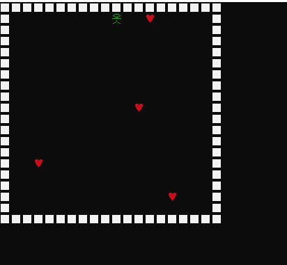
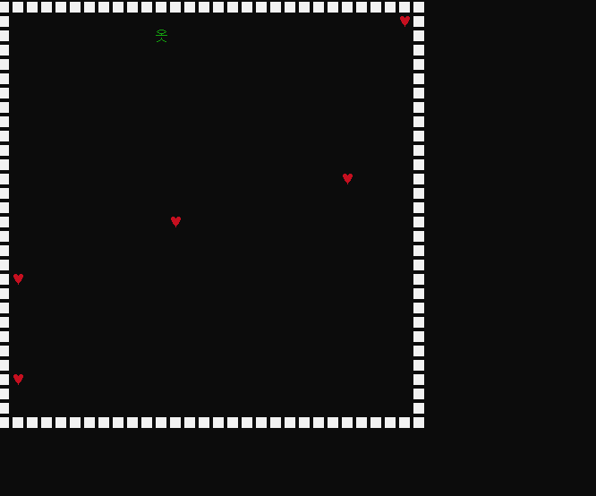

# Readme

## 버전 관리 Version Control, Chagne Log

### [0.01.01] 2025-03-10 프로젝트 생성 및 진입점 구현
### 기능 추가(Added)
- 아이템을 먹으면 출구가 열리게 기능을 구현했다.

### 변경 사항(Fixed)
- 변경 사항1
- 변경 사항2

강조 표시
*이텔릭체*
**강조**

>인용문

- 이미지 업로드, 강조 표시, 표 생성, 인용문 작성
</img>

### [0.02.01] 2025-04-08
### 게임 소개
어두운 미로 속을 아이템 획득을 통해 출구로 나가는 간단한 게임

### 기능 소개
- 기존의 작업물에서 스테이지를 하나 더 늘려 아이템을 다먹으면 다음 스테이지로 넘어가도록 기능을 구현했다.

### 사용한 문법들
## 구조체
# Player 구조체
typedef struct _PLAYER	// 플레이어 구조체
{
	char* playerShape;
	Pos playerPos;
	BOOL NextStage;
	BOOL mazeExit;
	int heartCount;
	int starCount;
	int CurrentStage;
	int prevPosX;      
	int prevPosY;      
}Player;

# Item 구조체
typedef struct _ITEM	// 아이템 구조체
{
	char* itemShape;
	Exit itemExit;

}Item;

## 포인터

## 2차원 배열

### 이미지
</img>
